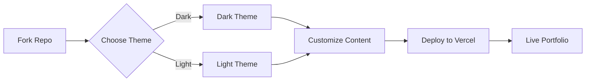

<div align="center">

# 🎨 Creative Portfolio Next.js Template

*Modern, animated creative portfolio with dual dark & light themes, Material-UI, and smooth scrolling*

[](https://vercel.com/new/clone?repository-url=https://github.com/MrShadowRIFAT/RNCYT5P-Creative_Portfolio_NextJS_Template)


**Two themes. Zero compromise. Pure creativity.**

</div>

---

## ✨ Why This Project

A beautifully crafted Next.js portfolio with built-in light and dark themes. Material-UI powered, smooth animations, and ready to showcase your creative work. Choose your vibe—both included.

---

## 🔥 Features

🌓 **Dual Themes** – Complete dark & light theme variants  
⚡ **Next.js 13** – Latest framework & performance optimization  
🎨 **Material-UI** – Professional component library  
✨ **Smooth Animations** – CSS animations & scroll effects  
📱 **Fully Responsive** – Mobile, tablet, desktop perfect  
🔄 **Smooth Scroll** – React-scroll integrated  
🎠 **Carousel Support** – React-slick included  
📞 **Contact Ready** – Form validation built-in  

---

## 🚀 Quick Setup

### 1️⃣ Fork Repository
```bash
# Click Fork button on GitHub
# Your own copy is ready
```

### 2️⃣ Deploy with Vercel
Press the button above → Connect GitHub → Deploy (instant!)

### 3️⃣ Local Development
```bash
git clone https://github.com/YOUR_USERNAME/RNCYT5P-Creative_Portfolio_NextJS_Template.git
cd RNCYT5P-Creative_Portfolio_NextJS_Template/dark
# or: cd light
npm install
npm run dev
# Open http://localhost:3000
```

---

## 📁 Project Structure

| Folder | Purpose |
|--------|---------|
| `dark/` | Dark theme Next.js portfolio |
| `light/` | Light theme Next.js portfolio |
| `dark/pages/` | Next.js pages (dark theme) |
| `dark/components/` | Reusable components |
| `dark/styles/` | SASS styling |
| `dark/public/` | Static assets & images |
| `dark/api/` | API routes (if any) |

---

## 🧠 How It Works



---

## 🎯 Theme Variants

| Feature | Dark | Light |
|---------|------|-------|
| Background | Deep Black | Bright White |
| Text Color | Bright White | Dark Gray |
| Accents | Neon Colors | Soft Colors |
| Best For | Modern, Tech | Clean, Minimal |
| Animations | Enhanced | Smooth |

---

## 🛠️ Tech Stack

<div align="center">


</div>

**Next.js 13** • **React 18** • **Material-UI 5** • **Emotion** • **SASS** • **React-Scroll** • **Slick Carousel**

---

## 📝 Customization

1. **Pick Theme** – Use either `dark/` or `light/` folder
2. **Edit Pages** – Modify `pages/` for your content
3. **Update Components** – Customize in `components/`
4. **Add Images** – Place in `public/` folder
5. **Adjust Styles** – Edit SASS in `styles/`
6. **Configure Theme** – Material-UI theme settings

---

## 🎨 Design Features

✨ **Smooth Scroll Navigation** – React-scroll integration  
🎬 **Animated Sections** – CSS animations on scroll  
📸 **Image Carousel** – React-slick for portfolio  
🎯 **Call-to-Actions** – Ready-made CTA buttons  
📱 **Mobile Optimized** – Touch-friendly interactions  
🔌 **Component System** – Pre-built components  
📧 **Contact Form** – Simple-react-validator included  

---

## 📦 Build & Deploy

```bash
# Development server with hot reload
npm run dev

# Production build
npm run build

# Start production server
npm start
```

| Platform | Deploy Time | Cost |
|----------|-------------|------|
| **Vercel** | 1 click | Free |
| **GitHub Pages** | 2 mins | Free |
| **Netlify** | 2 mins | Free |

---

## 🎬 Animation Libraries

- **Animate.css** – CSS animations
- **React-animated-css** – React wrapper for animations
- **React-scroll** – Smooth scrolling
- **React-slick** – Carousel functionality
- **Emotion** – CSS-in-JS styling

---

## 📊 GitHub Stats

<div align="center">


</div>

---

## 👨‍💼 Author

**MrShadowRIFAT** | [🔗 rifat.website](https://rifat.website) | [📧 noreply@rifat.website](mailto:noreply@rifat.website)

---

<div align="center">

**[⭐ Star This Repo](#)** • **[🐛 Report Issue](#)** • **[💡 Suggest Feature](#)**

Made with ❤️ for creative professionals

</div>
